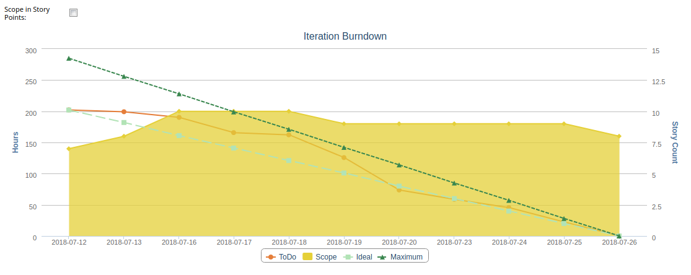

Iteration Burndown and Scope Tracking
=========================

## Overview

This burndown chart makes use of the Rally Lookback API to display the following metrics at the iteration level:
 * Iteration Scope (points or count)
 * ToDo (hours)
 * Ideal burndown (hours)
 * Maximum burndown (hours)
 
### Metrics

#### Iteration Scope

Updates daily with the number of User Stories and Defects being tracked in the iteration.
This is helpful in diagnosing issues with a sprint, say if a story is being pulled in
without following the team's process. It can also be useful in telling the story of
a sprint from a historical viewpoint during a retrospective.

#### ToDo

Updates daily with the total number of ToDo hours remaining for the team to complete
their planned tasks.

#### Ideal Burndown

Draws a straight line from the team's initial task estimate down to zero at the end of
the sprint. If the team's ToDo is above this line, it might mean that the sprint goal 
is at risk, and the team can take time to discuss how to handle the situation.

#### Maximum Burndown

Draws a straight line from the team's initial capacity down to zero at the end of the
sprint. Shown alongside the Ideal Burndown line, the Maximum can help a team that is 
over the ideal line understand whether the expansion is consumable within the sprint.
On the other hand, if a team is looking to bring in new work, this line can provide
guidance about how much is reasonable given the amount of iteration that remains. 

## License

Iteration Burndown and Scope Tracking is released under the MIT license.  See the file [LICENSE](./LICENSE) for the full text.

##Documentation for SDK

You can find the SDK documentation on Rally's help [site.](https://help.rallydev.com/apps/2.1/doc/)
